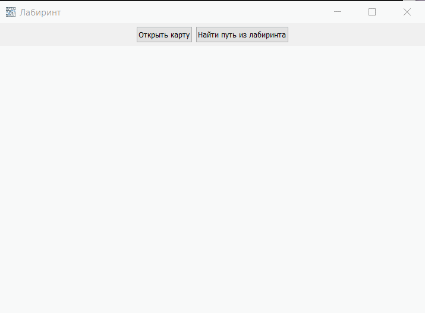

# Лабиринт

## Запуск

1. Запустите скрипт **install_deps.bat**.
2. Запустите скрипт **run.bat**.
3. Выберите карту с лабиринтом, нажав на кнопку **Открыть карту**. Требования к файлу с картой приведены в разделе **Файл с карткой**.
4. Нажмите кнопку **Найти путь из лабиринта**. В результате будет построен путь.

## Пример работы

## Файл с картой

- Вход в лабиринт должен быть обозначен латинской буквой *A*.
- Выход из лабиринта должен быть обозначен латинской буквой *B*.
- Преграды должны быть обозначены любым другим символом, кроме пробела.
